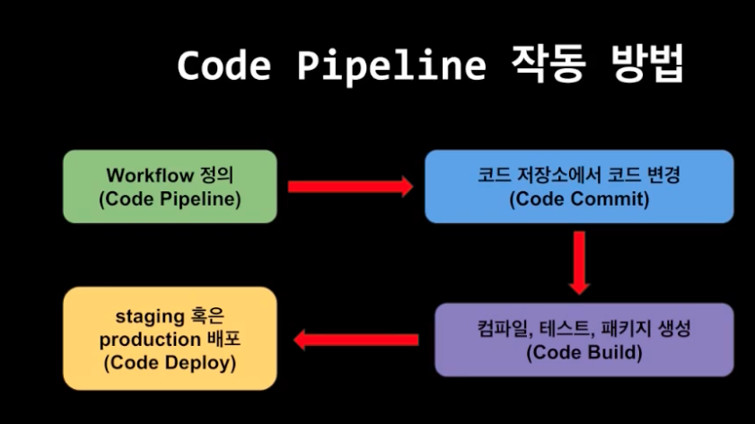

### ci & cd
- ci : continuous integration
- cd : continuous development
- 자동화 시스템
- incremental change 
  - a -> test -> b -> test

## code commit
- aws vsc
### 연결 방법
- https
- grc (git remote codecommit)
- 루트 계정은 ssh 연결을 할 수 없음
### 병합 방법
- 빠른 전달 병합
- 스쿼시 및 병합
- 3방향 병합


## code deploy 
- automated development 
- 새로운 기능들의 빠른 배포
- 다운타임 , 메뉴얼 에러 x
### rolling 배포
- 현재 프로덕션 서버
- 개발 후 프로덕션 배포 시
  - 첫 기능25(기존) % , 75% (새로운 서버)
  - 점진적인 배포
```
elb
- v0 (ec2)
- v0 (ec2)
- v0 (ec2)
```
- 첫번째 서버 셧다운 v0 -> v1
- 두번째 서버 셧다운 v0 -> v1
- 세번째 서버 셧다운 v0 -> v1
- 롤링 배포를 사용하면 이전 버전으로 돌아가는건 어려움
  - 하나하나 버전을 낮춰줘야 됨


### blue / green 배포
- blue: 현재 프로덕션
- green: 새로 배포할 녀석들
- 고객들은 프로덕션과 유사한 환경
- 블루 ->(트래픽) 그린 
- 블루 & 그린 배포 
불루를 셧다운 -> 그린으로
```
elb
- vo (ec2)
- vo (ec2)
- vo (ec2)
```
- 새롭게
- v1 (ec2)
- v1 (ec2)
- v1 (ec2)
```
그린 영역 생성 후 -> 블루 셧다운
- 다시 이전 버전으로 가고 싶다면?
  - elb 설정 스위치를 통해 쉽게 가능

#### 그럼 롤링 배포는 언제 써?
- 맨처음 배포할때에는 롤링 배포를
- 블루그린 배포는 새로운 프로덕션 환경
  - 추가적인 비용이 생김
  - 다운타임이 없으며 이전 버전으로 돌아가기 쉬움

### 카나리아 배포
- TODO

#### code deploy practice
- iam
    - s3
    - ec2 (for code deploy agent)
    - code deploy
#### code deploy agent
- user
  - 권한
        - s3 
        - code deploy    
- ruby 기반 
- wget 
  - amazon 
  - aws configure 
`sudo service codedeploy-agent status`

#### local machine -> deploy
- iam access key , secret access key
- local machine
  aws configure
`appspec.yml` -> aws 관련 파일
- yml 파일로 코드 deploy 관련 파일들을 관리 가능
```
hooks:
  Bedoreinsall:
    - location:
    - timeout: 300
    - runas: root
```
-> s3 bucket
배포그룹 생성


### code pipeline
- 빌드  테스트 배포 과정을 관리
    코드 변경시 code pipeline은 이를 감지할 수 있음
- 소프트웨어 및 어플리케이션 출시 자동화
- workflow 정의
- code commit
- code build
- code deploy
