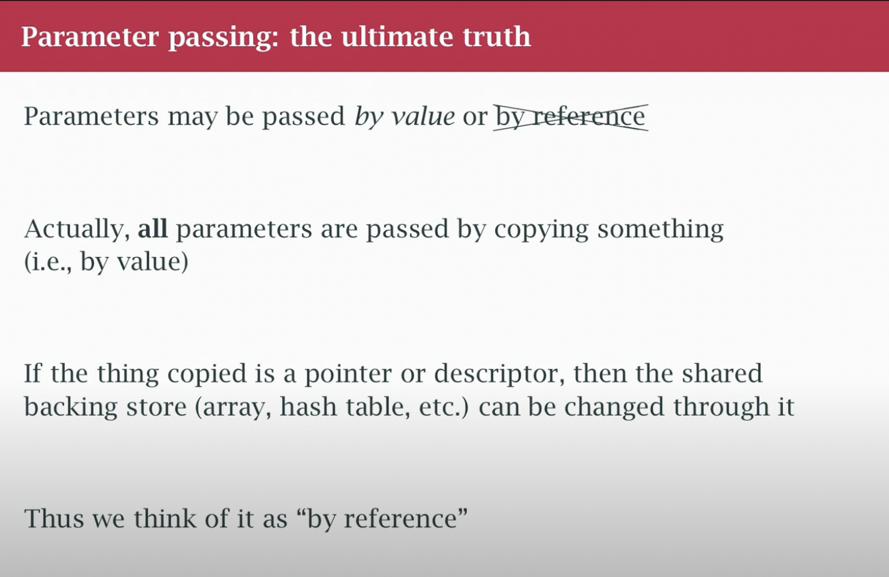
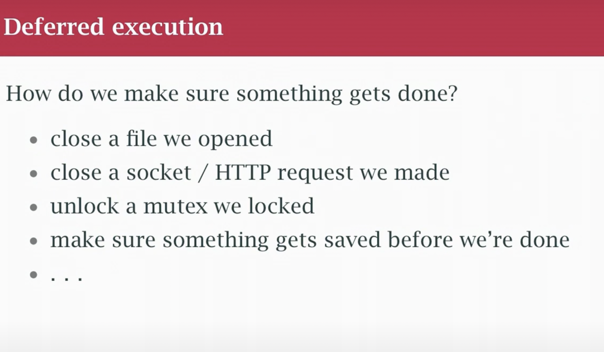
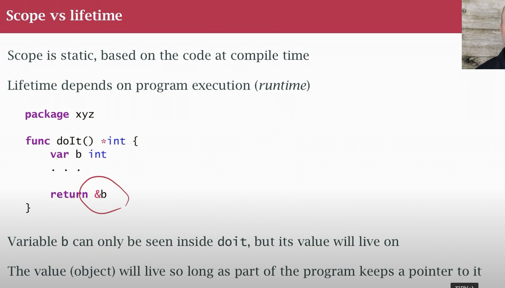
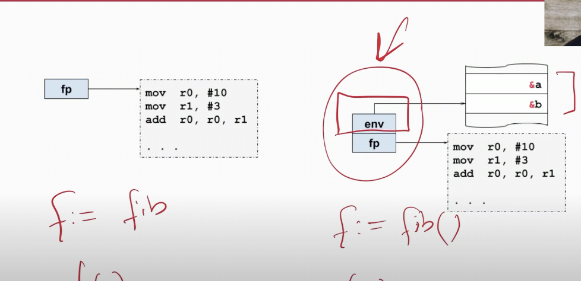

- c , c++에서는 함수 안의 로컬 value를 포인터로 return 하면 에러가 나겟지만 go에서는 에러가 안난다?
- escape 분석 in go compiler

- 요즘 현대언어들이 heap에 할당을 많이 하고 있지만 이것은 비효율적인 접근이다
- stack을 많이 활용하자


- 함수와 closure의 차이
  - 할당의 유무
  - 은닉화와 캡슐화 지원
  - 외부함수가 소멸한 후에도 기억하고 제공
>클로저는 독립적인 (자유) 변수를 가리키는 함수이다. 또는, 클로저 안에 정의된 함수는 만들어진 환경을 ‘기억한다’.
```go
f:= fib // f is function pointer

f:= fib() // f is clousre
```

``` go

func fib() int {
a , b := 0, 1
return func () int {
    a, b = b, a+b 
    return b
}
}
func main(){
    f := fib()
    g := fib()
    // f and g is different  
    for x := f() ; x < 100; x = f(){
        fmt.Println(x)
    }
}
```

- keep in mind (why g and f is different?)
> it has the same function pointer but the environment pointer is different



#### edge case in golang closure 
```go
package main

func do ( func ()) {
    d ()
}

func main() {
    for i:=0 ; i <4 : i++ {
        v := func() {
            ...
        } // the v's memory location is same
        do(v)
    }
}
```
- `v` memory location is same why?
- because each `i` in for loop (1 ~ 2 ~3)have same memory

```go
func main() {
    s := make([]func() , 4)
    for i:= 0 ;< i4 ; i++{
        s[i] = func (){
            //
        }
        s[i]()
    }
}
```
- this is bug in code not language
- how to avoid this situation
```go
func main() {
    s := make([]func() , 4)
    for i:= 0 ;< i4 ; i++{
        i2 := i // closure capture
        s[i2] = func (){
            //
        }
        s[i2]()
    }
}
```
```
