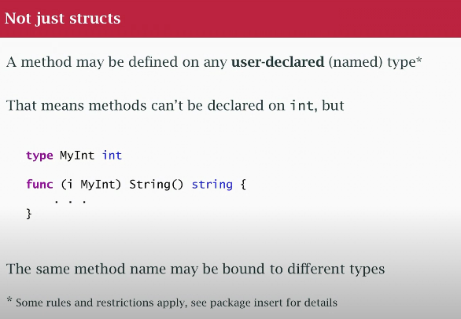

# methods and interface 


- an interface specifies abstract behavior in terms of methods 

- method is special type of function 
- it has `reciever` parameter before the function name parameter 
```go
tpye InstSlice []int 
func(is IntSlice) String () string {
    ...
}

```

- a method may take a pointer or value receiver, but not both


