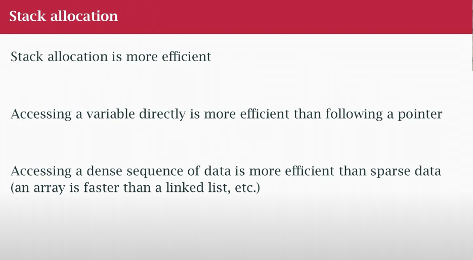
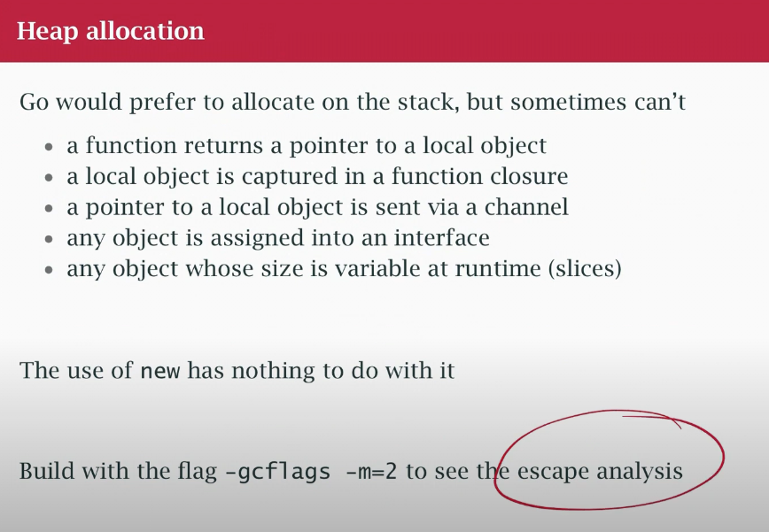
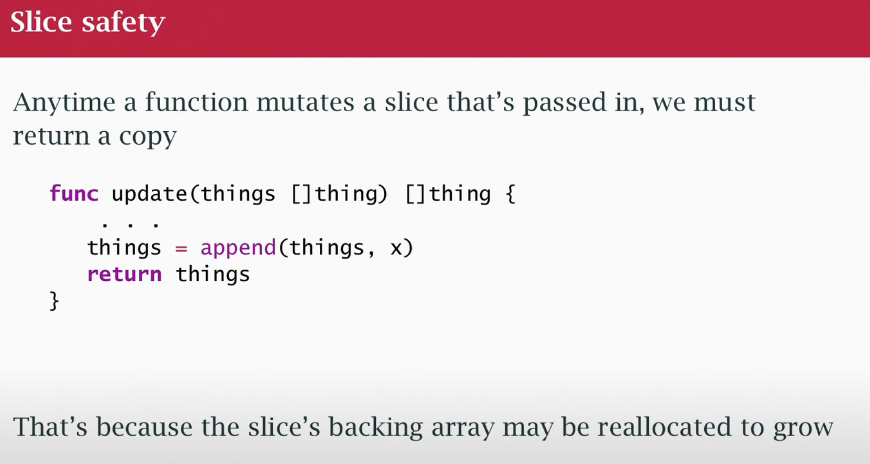

### must not copy 
- any struct with a mutex must be passed by reference
- any small struct under 64 bytes probably should be copied
- go routinely copies string & slice descriptors
- if a thing is to be shared , then always pass a pointer 
```go
type Employee struct {
    ...
}
func do (emp * Employee) {
    defer 
}
```



```go
new(x) 
&x{} 
```
