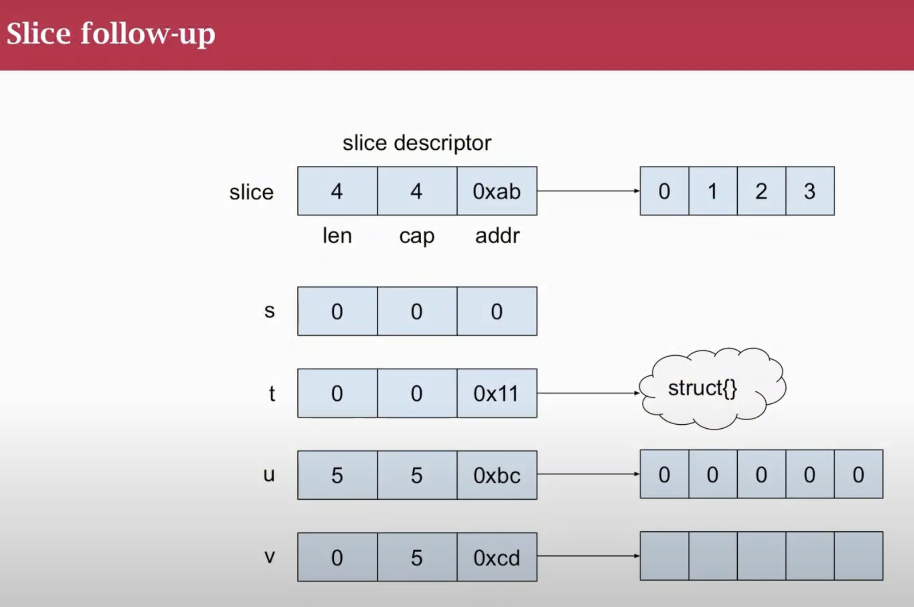
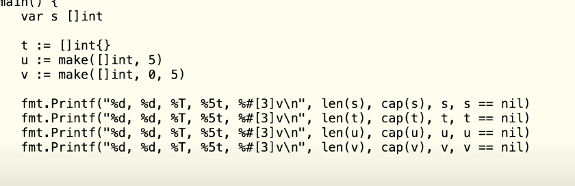

- golang sentinel value

- empty vs nil slice 
slice and maps encoding differently in json when nil

``` golang
func main() {
    var a []int
    j1 , _ := json.Marshal(a)
    // then j1 is null

    b := []int{}
    j2 ,_ := json.Marshal(b)
    // then j2 is []
}

```