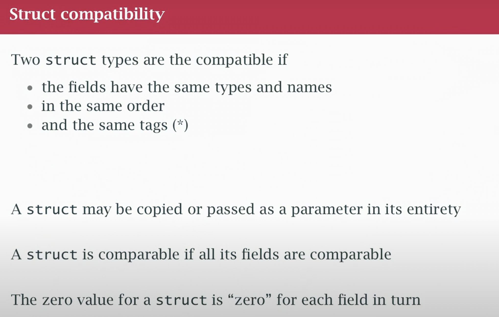
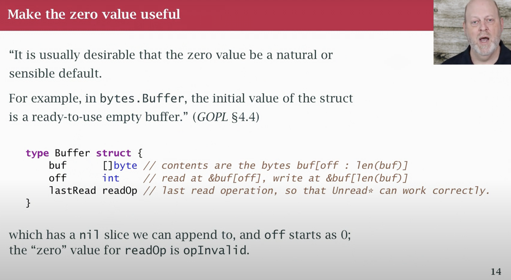

```go

type Employee struct {
    Name string 
    Number int 
    Boss *Employee
    Hired time.Time 
}
func main() {
    var e Employee
    b = &Employee { } //create struct in a sense anonymously take its address
    e.boss = b  // it is expressed as  structure
    b = Employee {}
    e.boss = &b // it is expressed as pointer memory address 
```

- using `.`  , using `struct literal`





- json marshal
- 