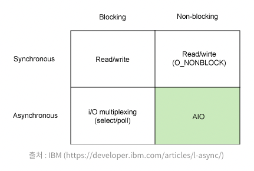

0809 https://hwangheek.github.io/2019/asynchronous-python/ 공부하기:
https://medium.com/from-the-scratch/dont-be-confused-between-concurrency-and-parallelism-eac8e703943a
https://www.youtube.com/watch?v=F19R_M4Nay4
https://www.youtube.com/watch?v=zAvWv_Wi0z0

>-  async echo system
>- event loop 
> - coroutines under the hood 
> - batteries included
> - interacting with the blocking world
 

### latency
-  what is synchronize between threads
-  thread is not independent program
-  so you can see `race condition`
  - when use only one lock 
  
  - lock starvation
  it is not always fair
  - deadlock
  - if you have more locks 
  - python has gil
    - gil을 끄고 여러 스레드가 병렬적으로 실행될수 있도록 더 세밀한 잠금으로 교체가 많았음
    - 결과적으로 성능이 나빠짐
- the goal of async io
  - maximize the usage of single thread
  - by handling i o asnychronously 
  - by enabling concurrent code using corutines
### concurrency && parallelism

### threads in python

### short history of asyncio

## async librar는 어떻게 동작할까
- [link](https://www.youtube.com/watch?v=F1aF4P1uBoU)
- asyncio.Transport
- asyncio.Protocol
  
### blocking vs no-blocking vs async 
https://jh-7.tistory.com/m/25

- 블로킹 넌 블로킹 동기 비동기 다른 개념
- blocking
  - A 함수가 B함수 호출, B함수는 자신의 작업이 종료되기 전까지 A함수에게 제어권을 돌려주지 않는 것
- non-blocking
  - A 함수가 B함수 호출 시,제어권을 A에게 넘겨주면서 A가 다른일을 할수 있도록 하는것 
- sync
  - A함수가 B함수 호출 시 , B함수의 결과를 A가 처리
- Async
  - A함수가 B함수 호출 시 , B의 결과를 B가 처리