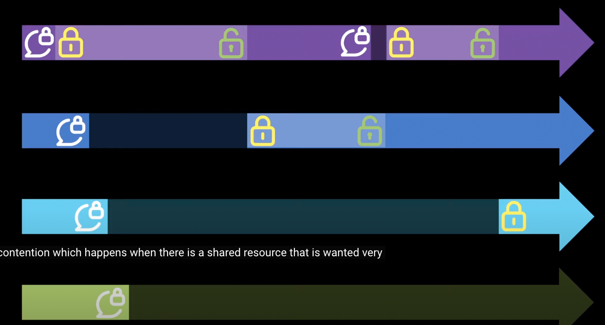

0809 https://hwangheek.github.io/2019/asynchronous-python/ 공부하기:
https://medium.com/from-the-scratch/dont-be-confused-between-concurrency-and-parallelism-eac8e703943a
https://www.youtube.com/watch?v=F19R_M4Nay4

>-  async echo system
>- event loop 
> - coroutines under the hood 
> - batteries included
> - interacting with the blocking world
 

### latency
-  what is synchronize between threads
-  thread is not independent program
-  so you can see `race condition`
  - when use only one lock 
  
  - lock starvation
  it is not always fair
  - deadlock
  - if you have more locks 
  - python has gil
    - gil을 끄고 여러 스레드가 병렬적으로 실행될수 있도록 더 세밀한 잠금으로 교체가 많았음
    - 결과적으로 성능이 나빠짐
- the goal of async io
  - maximize the usage of single thread
  - by handling i o asnychronously 
  - by enabling concurrent code using corutines
### concurrency && parallelism

### threads in python

### short history of asyncio

