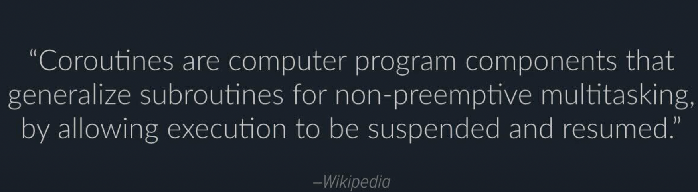

git comhttps://www.youtube.com/watch?v=NmSeLspQoAA
https://www.youtube.com/watch?v=QaiczQzJAmA
https://www.youtube.com/watch?v=PzOJn8uOV68
https://www.youtube.com/watch?v=_3LpJ6I-tzc

 - cpython uses a `stack based` virtual machine

multiple entry points 
- await : 일시정지 해줘 힌트 

frame 객체
- 함수가 실행될 때 필요 객체
- f_locals : local variables are stored 
- f_back: previous 

---
## Real world asyncio
https://www.youtube.com/watch?v=QaiczQzJAmA
### asyncio
- 비동기를 이벤트루프 기반으로 코루틴 형식으로 표현 및 실행
  - 내부적으로는 제너레이터처럼 취급
  - 운영체제마다 다양한 비동기 Io가 있음
  - 파이썬 Io는 그런 것들을 추상화해서 사용할 수 있음
  - 이벤트루프 주체가 내가 생성한 코루틴을 호출해줘야 됨
  - 최상위 호출자가 필요함 
  - 호출자가 없으면 제너레이터와 다를게 없음
- async def : 코루틴 함수 
- await f : 흐름 유지(함수 호출)
### cancellation 개념
- 코루틴이 외부 요인에 의해 중단되었음을 알려주는 여갛ㄹ
- 모든 await 구문에서 발생할 수 있음
- 예외적인 것보다는 내가 의도한 예외
- 코루틴으로 코딩할때 주의해야 될 것들:
  - 실행하는동안 캔슬레이션이 발생할수가 있음
  - 컨텍스트 스위칭 발생
- task 또는 future에 대한 참조
  - future는 어떤 비동기로 작동하는 작업이 있는데 그것이 끝날떄 알림을 줘
  - task는 중간의 여러번 테스크가 멈췄다 갈 수 있는 가정
### structed concurreny

- TODO
  - python은 task 기반?
https://www.youtube.com/watch?v=NmSeLspQoAA
https://it-eldorado.tistory.com/m/159
https://bentist.tistory.com/m/89

https://jh-7.tistory.com/m/25