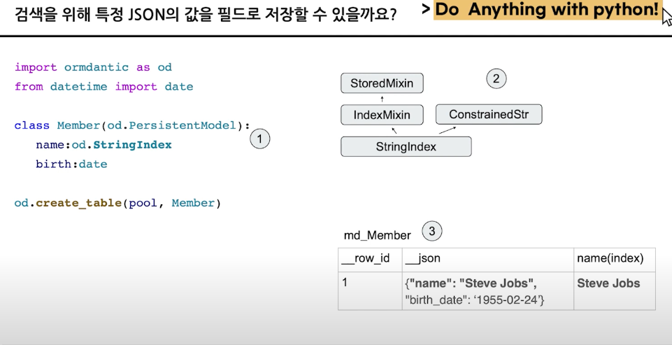
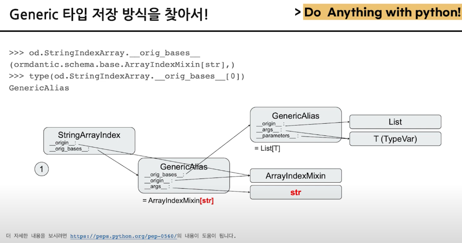

## 복잡한 객체 -> 데이터베이스로 관리하는 법
[link](https://www.youtube.com/watch?v=KAtO0zeR6wQ)
### 정의된 타입 정보는
- `__.annotations__`
- 객체를 인덱싱
  
  


  ## python type hint
  - [link](https://www.youtube.com/watch?v=3dGMBwARuN0)
  - 타입변수 제네릭
  - 제네릭의 공변성과 반변성
  - 탑타익, 바텀타익
  - 타입체커
  - 타입과 집합
    - iterable
      - collection
      - sequence
      - reversible
  - 서브타입
    - 부분집합
    - 서브타입은 슈퍼타입에 할당 가능
  - 리스트 & 튜플
    - 리스트는 동질적 데이터 시퀀스
    - 튜플은 이질적 데이터 시퀀스
      - 타입 인자가 각 위치의 타입을  지정
      - ellipsis를 이용해서 프로즌 리스트의 역할을 표현
    - pep585 
  - 타입정의 파일
    - stub file (*.pyi)
  - type narrowing
    - if match comprehensions 사용해서 가능
    - type guard: 타입을 좁히는 역할
- 타입변수와 제네릭
  - overload (type.overload)
  - functoools.singledpatch generator 사용해서
```python
class MySequence:
  @typing.overload
  def __getitem__(self, item:int) -> int: pass
  @typing.overload
  def __getitem__(self, item:slice) -> typing_extension.Self: pass
  def __getitem__(self, item):
    if isinstance(item,int):
      ...
    if isinstance(item,slice):
      ...
```
- 타입변수는 제네릭 함수/클래스에 활용
- `tpying.TypeVar`로 타입 변수 정의
  - bound subtype 한정
- 제내릭 클래스
  - typing.Generic 또는 다른 제네릭 클래스를 상속하여 커스텀 제네릭 클래스 구현
  - 제네릭 클래스에 대한 subscription은 __class_getitem__ 호출
- 공변성
  - TODO
- python 3.11
  - TODO

## typ it 
- [link](https://www.youtube.com/watch?v=3FO2mgxt-Xo)
- `Final` Keyword 추가 3.8
  - 해당 변수에 reassign 불가
  - 자식 클래스에서 재정의 불가
  - 지역/전역 변수에서 사용 가능
- mypy 분석기
- 순환참조 문제
  - `if TYPE_CHECKING` 사용
  - from __future__ import annotations
- 타입이 너무 복잡하면?
```python
class Adfilter(Protocol):
  def __call__(self, ad: Ad) -> bool:
    pass
ad_filter_map : dict[str, Adfilter] = ...
```