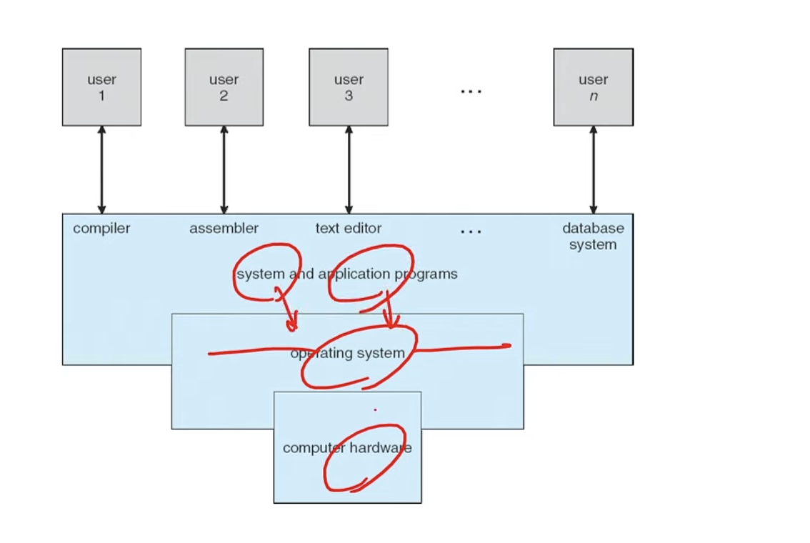
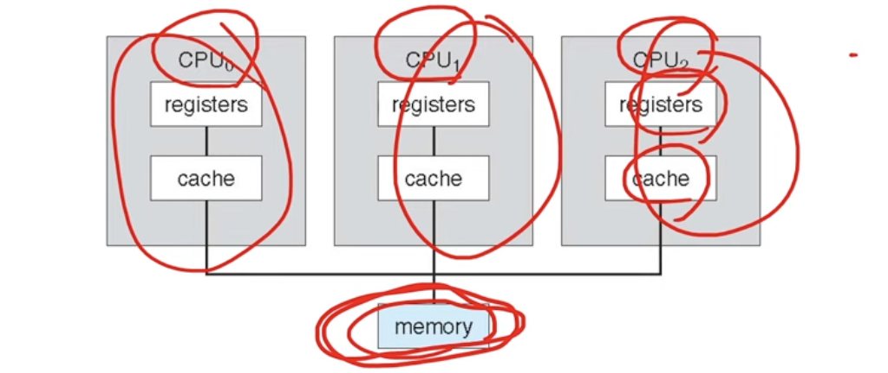
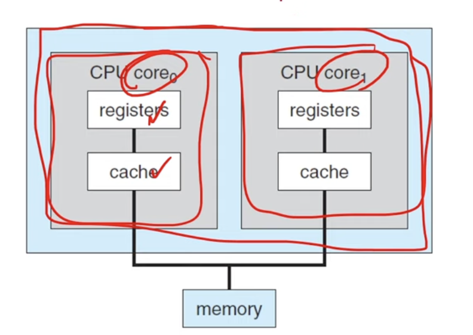
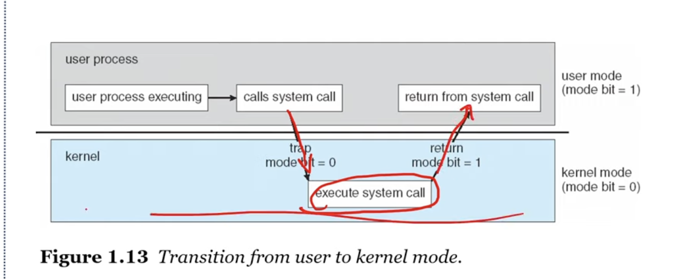
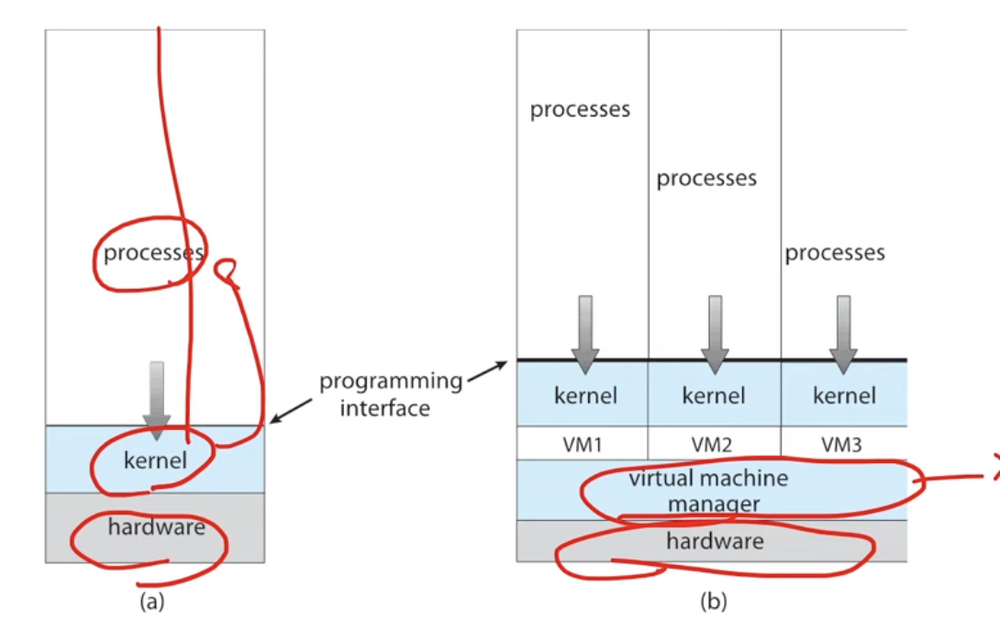

## 운영체제란
-  operates a computer system
- a comupter is a machine that processes information
- bit -> binary digit 정보의 최소 단위
- an information can be defined as 
a qunatitiative representation
- binary digit -> 정보의 최소 단위
  -  정보의 처리 NOT AND OR 
  -  논리 게이트 NOT AND OR XOR NAND NOR
  -  논리 회로를 만들 수 있음
  -  정보의 저장과 전송: 플립-플롭, 데이터버스
-  그래서 컴표터가 정보를 어떻게 처리하지?
   -  덧셈은: 반가산기, 전가산기
      -  뼬셈은 2의 보수 표현헙
   -  실수 연산은? 부동 소수점 표현법
-  컴퓨터는 만능?
   - NOT , AND, OR -> 게이트로 모든 계산을 할 수 있음
   - NAND 게이트만으로 모든 계산을 할 수 있음
   - 범용 컴푸터: general-purpose-computer
 - 계산 가능성: computability
   - 튜링 컴퓨터를: 튜링 머신으로 계산가능한 것
   - 정지 문제: halting problem: 튜링 머신으로 풀 수 없는 문제
- 컴퓨터의 오야봉
  - 엘런 튜링(*할아버지), 폰노이만(*아버지)
  - 튜링머신을 가지고 여러개를 가지고 -> 유니버셜 튜링 머신
  - CPU, Ran, Application Programs, Operating System -> 컴퓨터
  - 폰 노이만
    - a stored-program computer is
    a computer that stores programs in  a memory
    `cpu` <-(bus)-> `ram`
    -> 폰노이만 아키텍처, ISA 아키텍처 등장
- 그래서 프로그램이란?
  - a program is set of instructions
    - that tells a computer's hardware to perform a task
- 운영체제도 프로그램?
  - operating system is a program running at all times on the computer 
  - to provide system service to application programs
  - to manage processes, resources, user interfaces and so on


---
## introduction & os structures
### what operating system 
- manage computer's hardware

### operating system
- there are no universally accepted definition
- more common definition is that
the one program running at all times on the computer
- usually called kernel
- along with the kernel, there are two other types of programs
  - system programs
  - application programs
- a modern computer system consist of 
  - these days it is called classical computer (폰 노이만 구조)
### bootstrap
- 부트스트래핑?
  - the first program to run on computer power-on, and then loads the operating system 
  - 파워를 딱 키면 운영체제에 os를 로딩해주는 역할을 해야됨
    

### Interrupts
- I/O device
  - A라는 문자를 누르면 -> interrupt
  - CPU <-> I/O Device 
  - hardware may trigger interrupt at any time
    - by sending a signal to the cpu, usually by way of the system bus
### von neumann arch
- 명령어 집합으로 구성된 프로그램 -> 메모리에 로딩
- fech execute cycle
  메모리에서 명령어 레지스터 move, data register

- storage systems can be organized in a hierachy according to 
```
register
cache
main memory
solid-state-disk
hard disk
optical disk
magnetic tapes
```

### I/O Structure
- thread of execution
- a large portion of os code is dedicated managing I/O
  
### Symmetric multiprocessing (SMP)
- 메모리는 한개인데, CPU가 여러개 

- multi core design


### MultiProgramming
- 여러 프로그램을 메모리에 적재
  - runs more than one program at a time
  - keeps several processes in memory simultaneously
  - to increase CPU utilization
  - time sharing (*시분할)
  - 하나의 CPU가 여러개의JOB을 자주 바꿔주면
  여러개의 JOB들이 사용자입장에서는 동시에 돌아가는것 처럼 보임
  - concurrency
- CPU Scheduling
#### Two seperate mode of operations
- user mode and kernel mode
  -  cannot cause other programs to execute incorrectly
  -  커널모드에서만 하드웨어 작업을 가능하게 함
  -  user 모드에서는 직접적으로 하드웨어 접근하기 어렵게 함



### Virtualization
- a tech that allow us to abstract the hardware of single computer 
- VMM: virtual machine manager
  - vmware, wsl and so on

- OS provides an env for the execution programs
