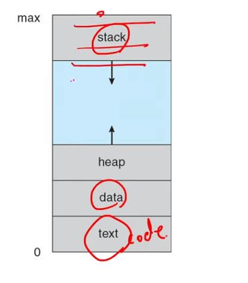
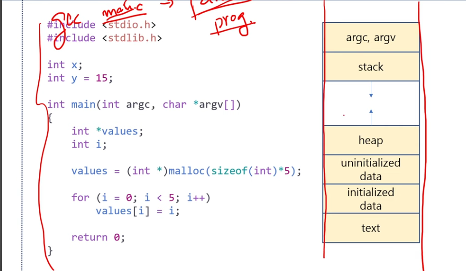
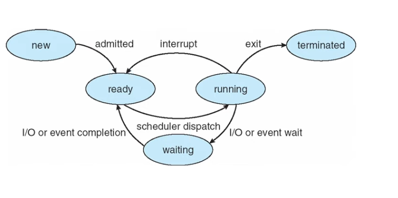
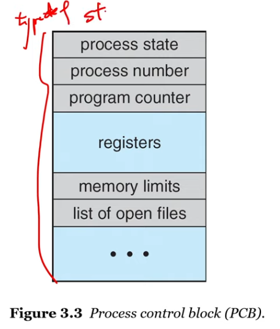
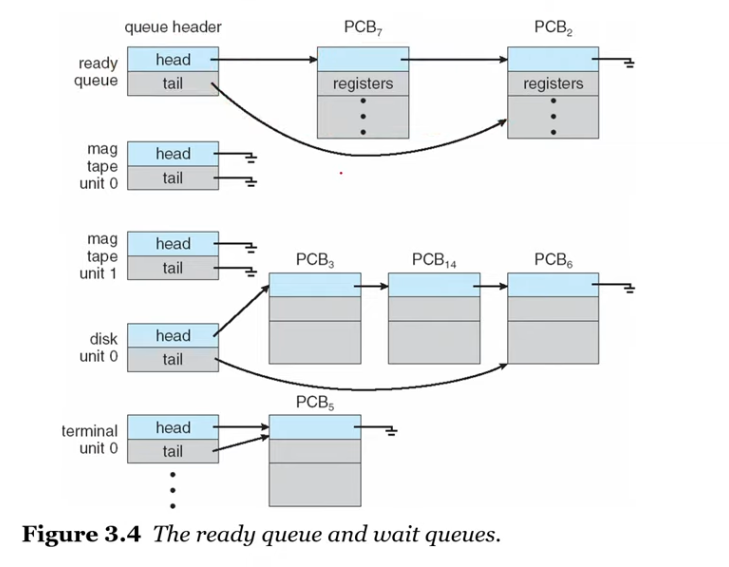
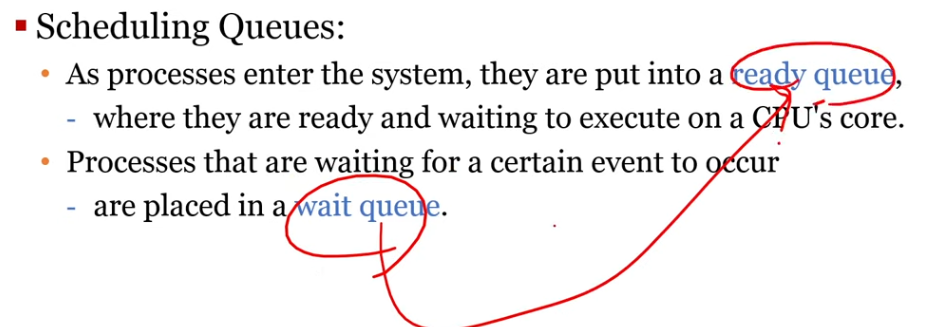
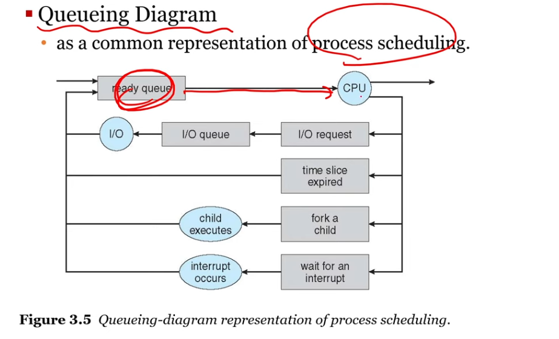
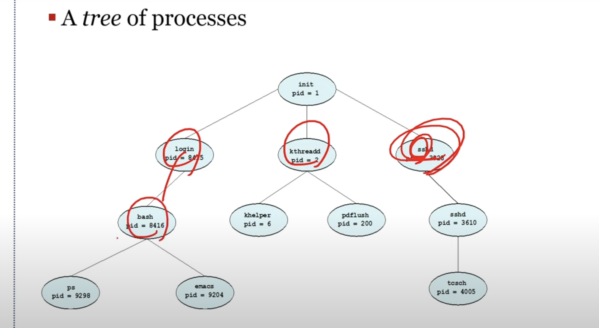

## process

- os의 중요한 일 중 하나 -> 프로세스 관리
- a process is a program in execution
- a process is the unit of work in an os 
- a process will need certain resources to accomplish its task
  - cpu time
  - memory
  - files
  - io

### process concept

- text section
- data section
    - 전역 변수 (초기화 or not)
- heap 
  - dynamic memory allocation
- stack
  - 함수 호출 영역 function (param, function, etc)

### process life cycle

- New: 막 생성된 상태
- Running: CPU 점유해서 프로세스의 명령어를 CPU에 로드
- Wating: CPU 시분할 스케쥴링을 통해 waiting 상태 -> I/O 하다 자별적으로 waiting
- Ready: IO 컴플리션 대기하다가 ready queue에서 대기
- Terminated: 모든것을 다 끝낸 상태 (Exit, main func -> return)
- 스케쥴러가 디스패치: ready -> running 상태

### PCB or TCB

####  PCB

- process control block
- pcb contains many pieces of info associated with the specific process
- process state
- program counter: instruction register: 프로그램 카운터 레지스터리 중요한 정보
- cpu register: ir , dr 
- cpu scheduling information
- memory management info
- accounting info
- i/o status 

#### tcb

- task control block

### process 

- a process that perfomrs a single thread of execution
- the single thead of control allows the processes to perform 
  - only one task at a time 
- modern operating systems have extended the processes concept 
  - to allow a process to have multiple threads of execution
  - and thus to perform more than one task at a time

### thread
- a thread is lightweight process
- pcb를 이용해서 os가 타임 쉐어링 -> multi processing
- 위 개념 응용 multi threading

### Multi programming
- to have some process running at all times
  - at the same time
  - simultaneously
- so as to maximize cpu utilizations
- the objective of time sharing is
  - to switch cpu core among processes so frequently
  - that users can interact with each program while it is running
#### scheduling queues
- fifo
- cpu를 바로 획득하는게 아니라 대기열에서 대기하는 시간을 가짐(*readyqueue)
- running 상태에서 waiting 상태로 가는 경우도 (IO completion)
- linked lists of pcb
- cpu가 fork 했을 때 -> new -> ready queue

### context switching
- the context of process is represented in the PCB
- when an interrupt occurs
  - the system saves the current context of running
  - so that, later it can restore that context when it should be resumed
- the context switch is a task that
  - switches the cpu core to another process
  - perform a state save of the current process
  - and a state restore of a different process

- an operating system must provide a mechanism for 
  - process creation
  - and process termination
- a process may create several new processes
- fork 라는 system call을 이용해
    - init pid=1 (최상단 부모 )

- two possibilities for execution
  - 부모와 자식이 concurrent하게
  - 부모가 자식이 죽을때까지 기다리기(wait)
- two possibilities for address-space
  - child process is a duplicate of the parent process
  - child process has a new program loaded into it 

### operations on processes
- zombie and orphan
  - zombie process: 부모가 wait을 하지 않고 
  - orphan process: 부포 프로세스가 wait를 호출하지 않고 종료 -> 부하 

### operating on processes
- in unix-like o/s
  - a new processes is created by the fork system call
  - the chlid process consists of 
    - a copy of address space of the parent process
    - 