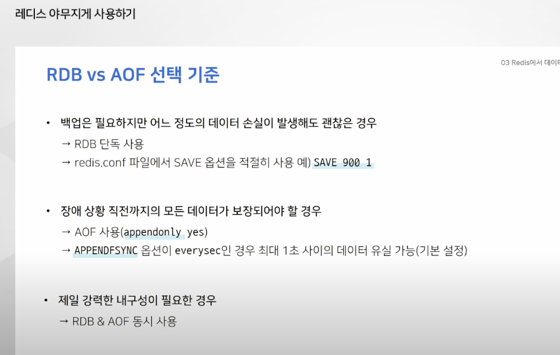
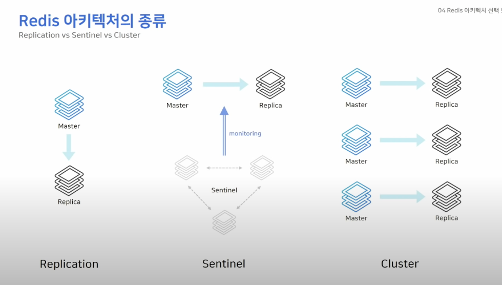
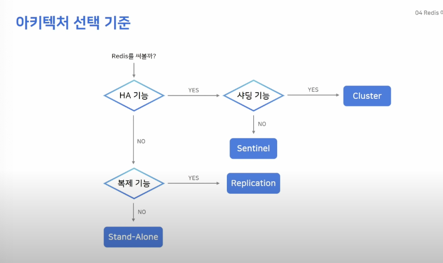
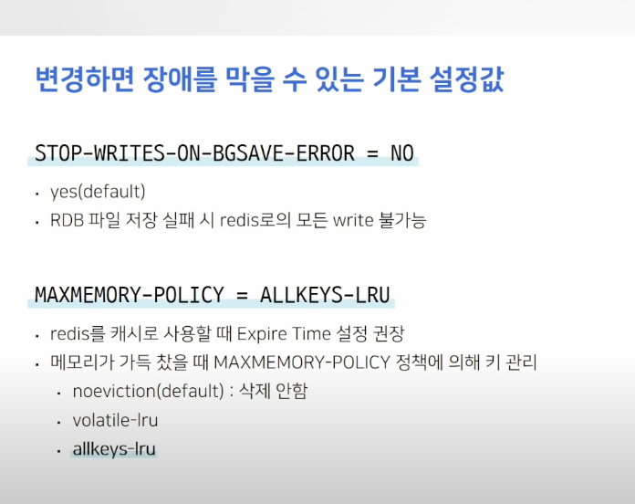
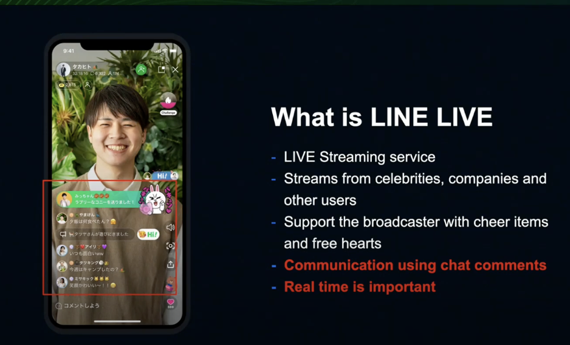
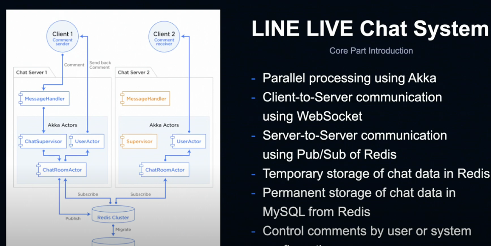
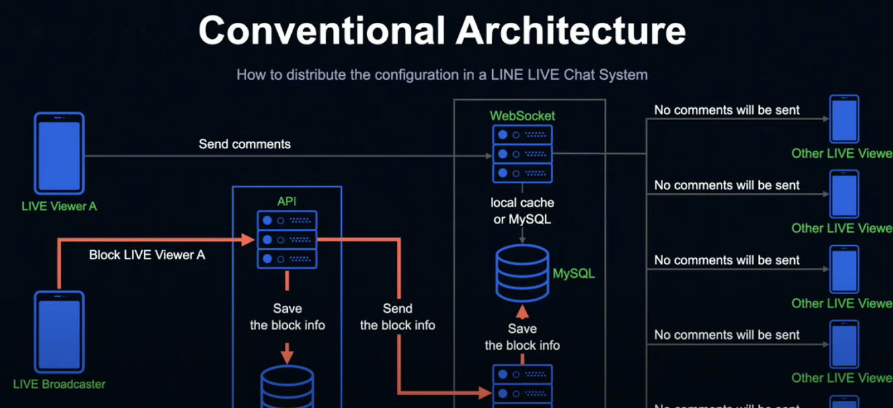
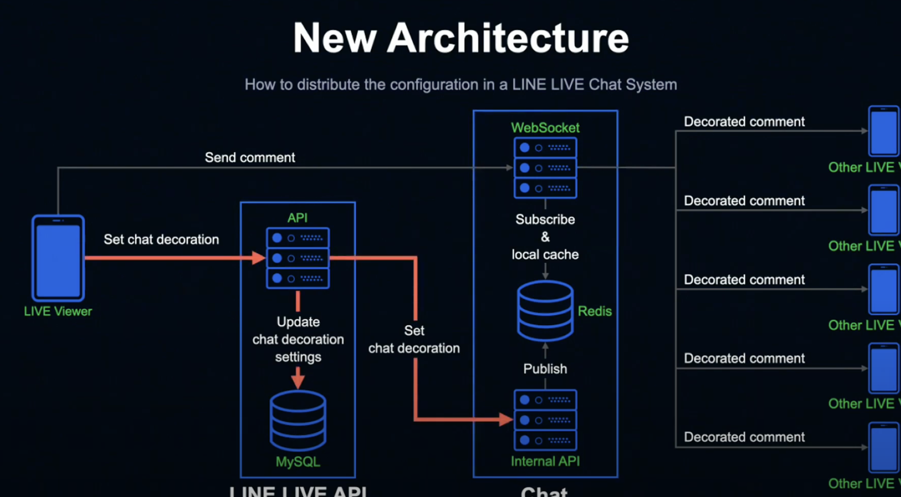

## 레디스 야무지게 사용하기
> https://www.youtube.com/watch?v=92NizoBL4uA
> - 캐시로 사용하기
> - 데이터 타입 야무지게 사용하기
> - 데이터를 영구 저장하려면? (rdb vs aof)
> - 아키텍처 선택 노하우(replication vs sentinel vs cluster)
> - 운영 꿀팁  + 장애 노하우

### redis를 캐시로 사용하기
#### 캐싱이란?
- 데이터의 원래 소스보다 더 빠르고 효율적으로 액세스 접근
- 동일한 데이터 접근 & 같은 데이터 반복적 엑세스  
- 변화하지 않는 데이터 일수록 효율적 :)
  
#### 레디스는 딱 좋음 
- key - value
- in-memory store (ram)
- 빠르다 빨라 

#### 캐싱 전략 
- 읽기 전략 (look aside(lazy loading))
  - 어플리케이션은 데이터를 찾을 때 캐시를 먼저 찾음
  - 없다면 직접 디비에 
  - 이를 레이지 로딩이라고 부르기도 함
  - 캐시 미스 시 성능저하가 일어날 수 있음 
    - 미리 디비에 캐시를 밀어 넣는 cache warming

- 쓰기 전략 (write around , write through)
  - write around
    - 캐시미스 난 경우에만 데이터를 가져옴
  - write through
    - 무조건 둘 다(rdb redis)에 넣어 줌 , 캐시미스 적지만 그만큼 시간 & 공간 사용자

### 데이터 타입 
- 데이터를 순서대로 저장하는 타입 리스트 -> 큐로 사용하기 좋음
- sorted score
- hyperlogs: 많은 데이터 
- streams: 로그 저장
#### 카운팅 할 때
- 스트링을 사용하자 
- bit 연산을 사용 
  - 데이터 저장공간 절약
  - 정수로 된 데이터만 카운팅 가능 
- hyperlogs 대량의 데이터 카운팅 할 때 유용 (몇천만 몇백만 -> 무조건 12kb)
- 검색엔진 , 유니크 한 값 -> 다 유용 
#### 메시징 
- 리스트 , 블로킹기능도 제공
- lpushx , rpushx 
  - 이미 캐싱되어 있는 피드에만 신규 트윗을 저장 
  - 트위터 자주 사용하던 유저는 미리캐싱 
- streams
  - 로그를 저장하기 위한 가장 적절한 구조
  - append-only 시간범위로 검색 
  - 카프카처럼 소비자 그룹이 존재
  - 메시징 브로커를 사용하고 싶을 때 카프카 대체가능 
### 저장방법
- 레디스는 인메모리 
- 복제구조를 사용하더라고 , 복원 불가한 상황이 생김 
- append only file 
  - 디테일한만큼 용량도 많다 
  - 주기적으로 압축해서 재사용
  - 레디스 프로토콜 형태로
- rdb  snap shot 
  - 바이너리 형태로
- 원하는 시점 단위로 가능 
#### rdb vs aof 
- 레디스를 캐시로만 사용한다면 사용 필요 없음 

### 레디스 아키텍처의 종류 

#### replication 
- 마스터 - 슬레이브 
- 단순한 복제 연결 
- 복제는 비동기식으로 존재
- ha기능이 없으므로 장애 상황 시 수동 복구 
- 애플리케이션이 연결 정보 변경
#### sentinel 
- 마스터 - 센티넬 -슬레이브 
- 센티넬은 구경하는 존재 
- 자동 패일오버 가능한 ha 구성 
- sentinel 노드가 다른 노드 감시 
- 마스터가 비정상 상태 -> 자동으로 페일오버 
- 센티넬 노드는 항상 3대 이상의 홀수로 존재해야 됨 
  - 과반수 이상의 센티넬이 동의할 때 페일오버 진행 
#### cluster 
- 최소 3개의 마스터가 존재
- 샤딩 기능 제공
- 스케일 아웃가 ha기능
- 키를 여러 노드에 자동으로 분할해서 저장 (샤딩)
- 모든 노드가 서로를 감시하며, 마스터가 비정상 일 때 자동으로 페일오버 

#### 운영 꿀팁 
- 레디스는 싱글스레드로 동작중 
- keys -> scan 
- 운영하다가 실수로..
- keys는 쓰지 않는거 추천 
- 좋은 성능을 원한다면 하나의 키에 100만개의 데이터 정도로 
- 변경하면 장애를 막을 수 잇는 값 

- ttl값을 너무 작게 설정하면
박살 날 수 있음 

### redis pub & sub 
- https://www.youtube.com/watch?v=CENLaIz2Yb8
- 매일 시스템이 정상적으로 돌아가고 있는지 궁금..(로그 & 매트릭스 열심히 보는중 )
- 인프라 네트워크 장애에도 신경이 쓰인다 
#### line live ? line chat system 

- 사용자 <-> 서버 `웹 소켓`
- 라인은 현재 120대의 서버를 두고 잇으며  서버간 통신은 `pub/sub of redis` 사용중 
  - 어떻게 동기화 하고 코멘트 제어?
  - 아키텍처에서 
- 일시적인 데이터 -> 레디스
  - 뒷단에서 정규화 후 -> mysql에  
- 영구적인 데이터 -> mysql from redis
#### 아키텍처 
- 지금까지 사용해온 기존 아키텍처 
  - 방송자가 시청자를 차단하는 경우 
  
    - 차단하는 경우 해당 방송에 표시되지 않도록
    - 다만 누군가가 차단할때마다 일일이 디비에서 조회한다면 스파이크 
    - 기한부 로컬 메모리를 사용했음
    - 각서버에서 개별적으로 취득했음 

- 바뀐 아키텍처 
  